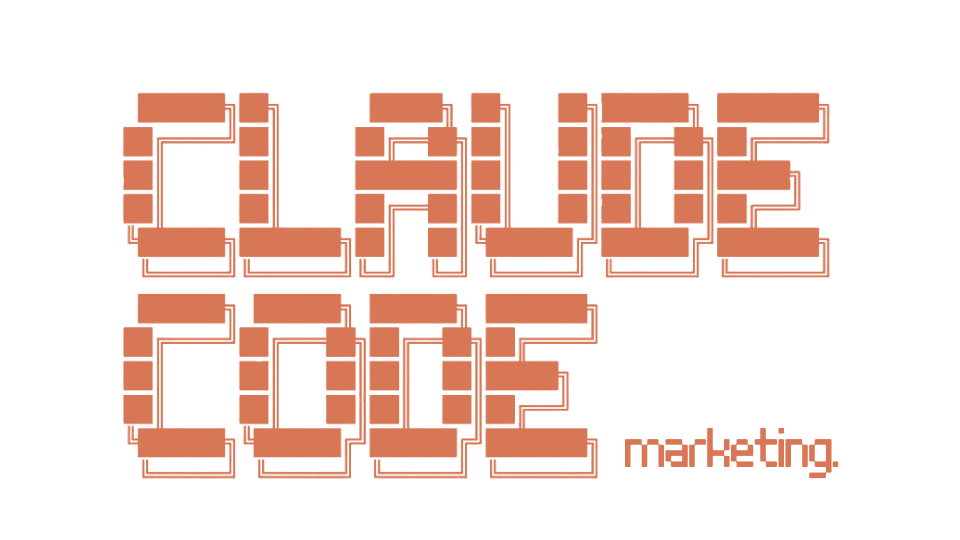

<p align="center">
  
</p>

<p align="center">
  <a href="https://github.com/itsbariscan/claude-code-marketing/blob/main/LICENSE"></a>
  <a href="#"></a>
  <a href="#"></a>
  <a href="#"></a>
  <a href="https://github.com/itsbariscan/claude-code-marketing/issues"></a>
</p>

<p align="center">
  <strong>80+ Claude Code plugins exist. All for developers.</strong><br>
  <em>This one's for us.</em>
</p>

<p align="center">
  <a href="#installation">Install</a> •
  <a href="#quick-start">Quick Start</a> •
  <a href="#features">Features</a> •
  <a href="docs/">Docs</a>
</p>

---

## The Problem

You open Claude Code. You ask for keyword ideas.

Claude gives you generic advice. No context. No memory. Every session starts from zero.

You explain your client again. Their industry. Their competitors. What worked last time.

**Again.**

---

## The Solution

```
You: I'm working on olfacto

Claude: Loading Olfacto context...
        ├── Fragrance discovery platform
        ├── Competitors: Fragrantica, Basenotes
        └── SEO focus: comparison content, dupes

        What would you like to work on?
```

One sentence. Full context. Ready to work.

---

## What This Actually Does

**Remembers your clients.** Create a brand once, use it forever. Switch between clients instantly.

**Asks before advising.** No generic "create great content" nonsense. Claude asks what it needs to know, then gives specific recommendations.

**Works without APIs.** Reasoning-based analysis out of the box. Connect Ahrefs/SEMrush/GSC when you want live data.

**Persists across sessions.** Close Claude Code. Come back tomorrow. Your brand is still there.

---

## See It Work

```
You: create a content brief for "best cologne for office"

Claude: 📝 CONTENT BRIEF

        Target: "best cologne for office"
        Intent: Commercial
        Word count: 1,500-2,500

        OUTLINE:
        H1: Best Cologne for the Office
        H2: What Makes a Good Office Cologne?
            → Projection rules, note families that work
        H2: Best Office Colognes by Category
            → Budget, luxury, seasons, occasions
        H2: How to Wear Cologne at Work
            → Application tips, common mistakes
        H2: FAQs
            → Schema markup targets

        FEATURED SNIPPET TARGET:
        "The best office colognes are clean, fresh scents
        with moderate projection. Top picks include..."

        INTERNAL LINKS:
        → Fragrance quiz, comparison pages, note guides
```

That's with brand context loaded. No setup. No prompting tricks.

### Strategy Work

```
You: help me position against competitors

Claude: Before I write positioning, I need to understand:

        1. What problem does Olfacto solve that competitors don't?
        2. What can you claim that Fragrantica cannot?

You: We have AI recommendations. Fragrantica is just a database.

Claude: POSITIONING: Olfacto

        FOR: Fragrance enthusiasts overwhelmed by choice
        WHO: Want personalized recommendations, not infinite browsing
        OLFACTO IS: The AI fragrance advisor
        THAT: Learns your taste and surfaces hidden gems
        UNLIKE: Fragrantica (database) and Basenotes (forum)
        BECAUSE: We recommend, they just catalog

        MESSAGING ANGLE:
        "Stop searching. Start discovering."
```

Discovery gates in action. Asks first, then delivers.

---

## Installation

```bash
git clone https://github.com/itsbariscan/claude-code-marketing.git
cd claude-code-marketing
./install.sh
```

Restart Claude Code. Done.

<details>
<summary>What the installer does</summary>

- Builds hooks from TypeScript
- Backs up your settings.json (we're careful)
- Copies hooks to `~/.claude/hooks/`
- Copies skills to `~/.claude/skills/`
- Creates `~/.claude-marketing/` for your data

</details>

---

## Quick Start

### 1. Create a brand

```
/brand new

Claude: What's the brand name and website?
You: Acme Corp, acme.com
Claude: What do they sell?
You: HR software for small businesses
Claude: Who are the competitors?
You: BambooHR, Gusto

✅ Brand created. Acme is now active.
```

### 2. Get to work

```
You: what keywords should I target?

Claude: Based on Acme's positioning (simple HR for SMBs):

        🏆 PRIMARY
        • "hr software small business" - your core term
        • "simple hr system" - matches your USP

        🥈 SECONDARY
        • "bamboohr alternative" - competitor capture
        • "hr software pricing" - commercial intent

        Want a content brief for any of these?
```

### 3. Switch clients

```
You: switch to TechStartup brand
Claude: [Loads TechStartup context]
        Ready. What are we working on?
```

That's it. No ceremony.

---

## Features

| Feature | What It Does |
|---------|--------------|
| **Brand Memory** | Save clients once, get context forever |
| **Discovery Gates** | Claude asks questions before generic advice |
| **SEO Intelligence** | Keywords, briefs, competitive positioning |
| **Strategy Builder** | Positioning, personas, channel planning |
| **MCP Integration** | Auto-detects Ahrefs/SEMrush/GSC when available |
| **Session Persistence** | Brand stays active across restarts |

---

## Commands

```
/brand              → Show active brand
/brand list         → All your brands
/brand new          → Create brand (guided)
/brand switch NAME  → Switch brands
/brand info         → Full brand details
```

Or just talk naturally:

- "I'm working on [client]" → switches brand
- "new client [name]" → creates brand
- "find keywords for [topic]" → SEO with context
- "help me position against [competitor]" → strategy

---

## MCP Integration

Works standalone. Gets better with data.

| Tool | What It Adds |
|------|--------------|
| GSC | Your actual rankings |
| Ahrefs | Volume, difficulty, backlinks |
| SEMrush | Competitor keywords |

```bash
# Optional - add if you have subscriptions
claude mcp add gsc
claude mcp add ahrefs
```

When detected, output changes:

```diff
- Data Source: Reasoning-based
- Confidence: Medium
+ Data Source: Ahrefs MCP
+ Confidence: High
```

---

## Who This Is For

**Freelancers** managing multiple clients. Stop re-explaining context.

**Agencies** standardizing processes. Same discovery flow for every client.

**In-house teams** doing deep work. Build on previous sessions.

**Founders** doing DIY marketing. Get consultant-level thinking without the consultant.

---

## Your Data

- Stored locally: `~/.claude-marketing/`
- Format: JSON (readable, editable)
- No external servers
- Delete anytime: `rm -rf ~/.claude-marketing/`

---

## Project

```
claude-code-marketing/
├── hooks/          # Session hooks (TypeScript)
├── skills/         # /brand, /marketing-seo, /marketing-strategy
├── src/            # Core library
├── tests/          # 84 passing
└── docs/           # Architecture deep-dives
```

---

## Acknowledgments

This plugin stands on the shoulders of these projects:

### [Continuous Claude](https://github.com/parcadei/Continuous-Claude-v3) by [@parcadei](https://github.com/parcadei)

The idea that context shouldn't disappear between sessions. Their continuity ledger pattern—tracking state in simple files that persist across restarts—directly inspired how we store brand context. The philosophy: "each session makes the system smarter."

**What we borrowed:** Session persistence architecture, state.json pattern, the belief that AI tools should remember.

### [Superpowers](https://github.com/obra/superpowers) by [@obra](https://github.com/obra)

The radical idea that AI should ask before doing. Their "design refinement" pattern—where the agent asks clarifying questions before jumping to solutions—became our discovery gates. No more generic advice. Understand first, recommend second.

**What we borrowed:** Discovery gate pattern, the principle that good output requires good input, structured questioning flows.

### [Agents](https://github.com/wshobson/agents) by [@wshobson](https://github.com/wshobson)

The architecture of loading only what you need. Their three-tier progressive disclosure—metadata always, instructions when needed, resources on-demand—shaped how our skills activate. Context is precious. Don't waste it.

**What we borrowed:** Progressive disclosure pattern, modular skill architecture, context-efficient loading.

---

<p align="center">
  <sub>Built for marketers who live in the terminal.</sub>
</p>
